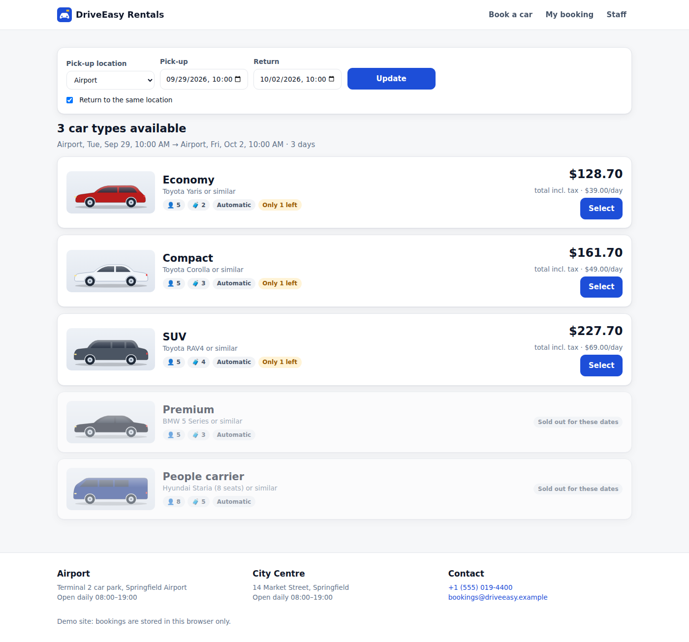
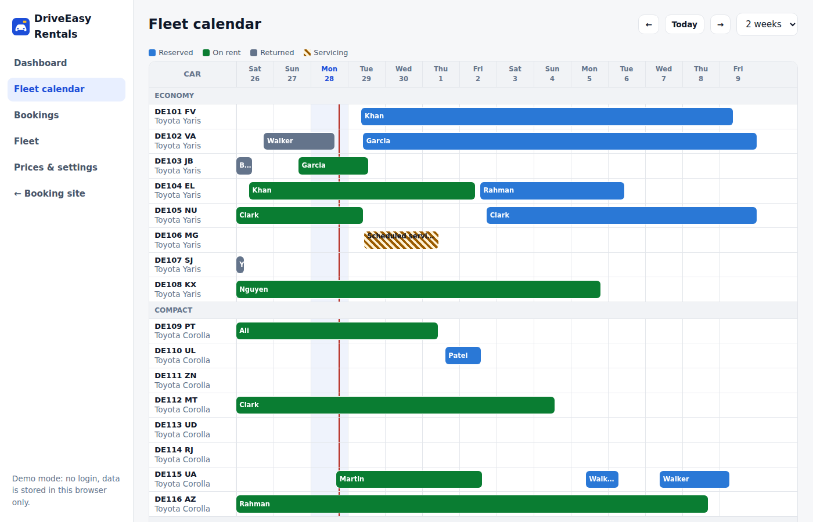
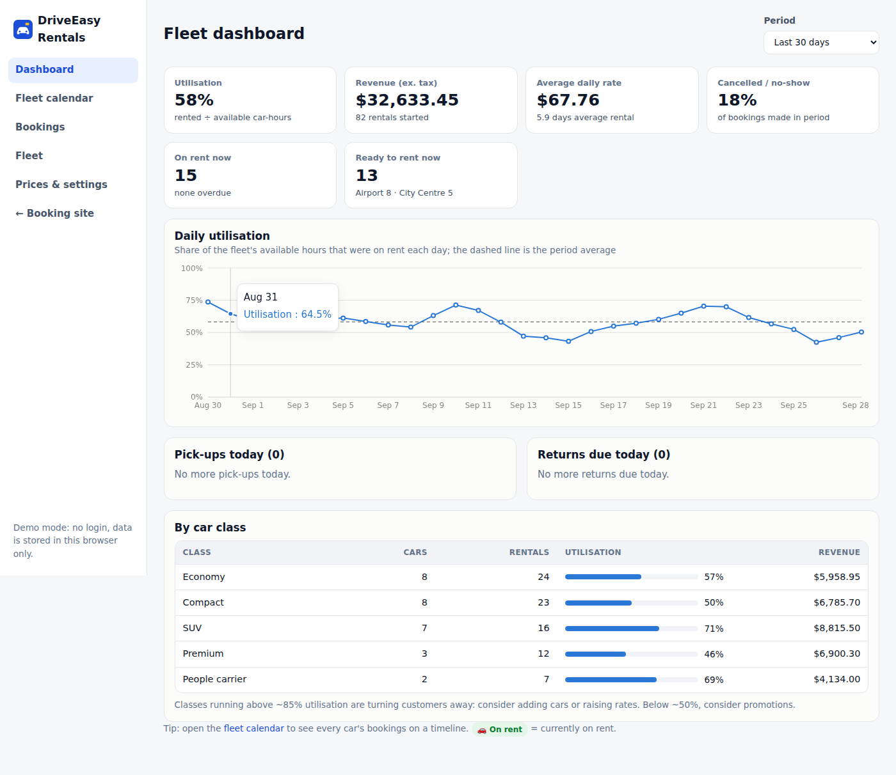
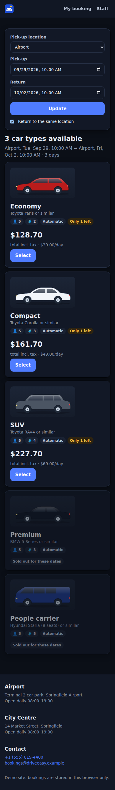

# Car rental booking site + fleet management

A rental company's customer booking site and back office in one app. It answers the questions a rental business pays developers for: can this car be booked, what should it cost, where is every car, and how hard is the fleet working?



| Fleet calendar | Dashboard | Phone |
|---|---|---|
|  |  |  |

## Customer site
- **Search** by pick-up/return location and time. Every class shows the live price for the dates, how many cars are left ("Only 1 left"), or "Sold out".
- **Book** with extras (zero-excess cover, extra driver, child seat, sat nav, with per-rental caps). The driver's details are validated, and the minimum age and young-driver fee are checked against the **pick-up date**. The booking gets a reference like `RC-7KQ2MX`.
- **Manage booking** needs the reference plus the email, with the same error either way so bookings can't be guessed. Free cancellation until 48 h before pick-up; after that, one day is charged.

## Staff back office (`/#/admin`)
- **Dashboard** with utilisation (rented ÷ available car-hours, excluding servicing), revenue, average daily rate, average rental length, cancellation/no-show rate, cars on rent, overdue returns, and cars ready at each location. Also today's pick-ups and returns, a daily utilisation chart, and utilisation and revenue per class.
- **Fleet calendar**: a timeline of every car's rentals and servicing, with a "now" line. Overdue cars show in red; click any bar to open the booking.
- **Check-out / check-in**: odometer (can't go backwards) and fuel out and in. The return screen previews the final bill before you confirm: extra days if late (after a grace period), missing fuel per eighth of a tank, and other charges.
- **Move a booking to another car** (only cars that are genuinely free are offered), mark no-shows, and cancel.
- **Fleet**: add or edit cars, see where each car is right now, 30-day utilisation per car, and maintenance blocks (refused if they clash with a booking).
- **Prices & settings**: daily rates and deposits per class, tax, discounts (7+ and 28+ days), fees, cleaning buffer, grace period, age rules, currency and locale. Also backup, restore and reset.

## The rules engine (`src/lib/rental.ts`)
All booking logic is pure, unit-tested functions:
- **Charged days**: every started 24 h counts after a grace period (default 59 min), with a minimum of 1 day.
- **Availability**: a car can take a rental only if it passes all of these checks:
  - no overlap with another rental, including a **cleaning buffer** on both sides;
  - no maintenance in the period;
  - it will be **at the pick-up location** (it follows the car through one-way rentals);
  - a one-way return won't **strand it away from its next booking**;
  - a car that's **overdue** is treated as still out.
- **Assignment** picks the free car that's been idle longest, so wear is spread across the fleet. The final check happens again at the moment of booking, so two people can't get the last car.
- **Pricing**: rate × days, long-rental discount, capped extras, young-driver fee, one-way fee, then tax. Money is kept in whole cents.

## Run it

```bash
npm install
npm run dev      # http://localhost:5173 (staff area at /#/admin)
npm test         # rules engine, store actions and demo-data integrity
npm run build
npm run smoke    # browser test of the customer and staff journeys, phone and dark mode (after build)
```

Demo data covers a 28-car fleet in 5 classes at 2 locations: 120 days of history and 30 days of forward bookings, around 60% utilisation. The generator guarantees no car is ever double-booked (checked in the tests). **Prices & settings → Reset demo** regenerates it around today's date.

## Deploy
Settings → Pages → Source: **GitHub Actions**. Pushes to `main` then test, build and publish it.

## Before taking real bookings
This is a demo build: data is stored in one browser, and there are no staff logins or online payments. For production, add:
1. A database and API, so the "last car" check runs on the server inside a transaction.
2. Staff logins.
3. Card payment and pre-authorisation for deposits (e.g. Stripe).
4. Confirmation emails and SMS.
